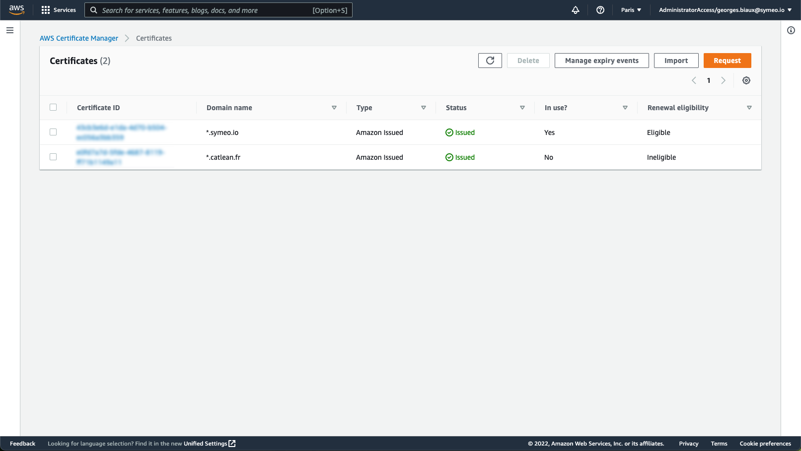
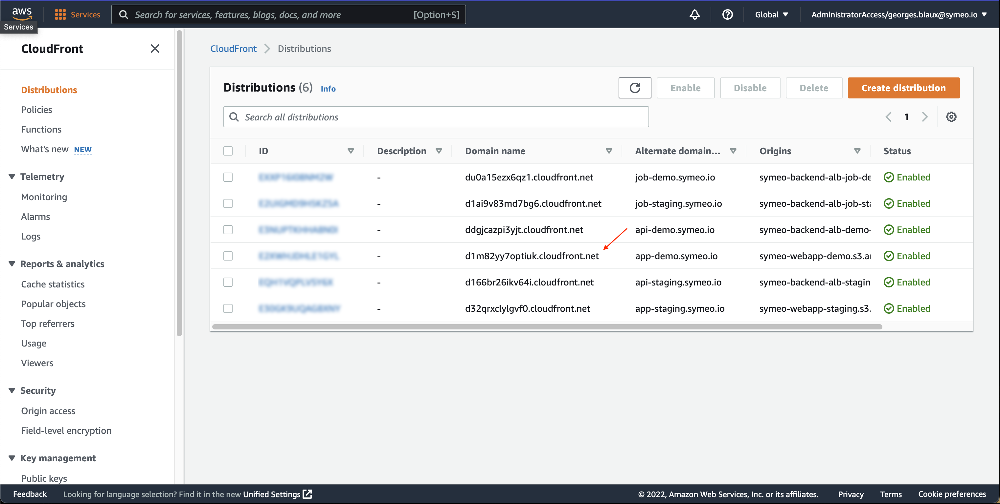

# How to create a new environment

## Create the GitHub App

- Go to symeo organization [GitHub Apps page](https://github.com/organizations/symeo-io/settings/apps) and click `New GitHub App`.
- For `GitHub App name`, follow the pattern Symeo-{env-name}
  - Except for production, which would be named Symeo
- For `Homepage URL`, enter https://www.symeo.io
- For `Callback URL`, enter the url of your env frontend, ending with `/onboarding-vcs`
  - https://app-demo.symeo.io/onboarding-vcs for example
- For `Setup URL`, enter the url of your env frontend, ending with `/onboarding-vcs`
  - https://app-demo.symeo.io/onboarding-vcs for example
- For `Webhook URL`, enter the url of the job api that will be deployed, ending with "/github-app/webhook"
  - https://job-demo.symeo.io/github-app/webhook for example
- For `Webhook secret`, generate a strong api key (with [this generator](https://generate-random.org/api-key-generator?count=1&length=128&type=mixed-numbers&prefix=) for example)
  - Keep the value somewhere to be able to put it in the env variables later
- Add the following permissions in `Access: Read-only`:
  - Repository permissions
    - Actions
    - Administration
    - Checks
    - Commit statuses
    - Contents
    - Deployments
    - Discussions
    - Merge queues
    - Metadata
    - Projects
    - Pull requests
  - Organization permissions
    - Members
    - Projects
    - Team discussions
- Click `Create GitHub App`

## Generate the GitHub App private key

- In the [GitHub Apps page](https://github.com/organizations/symeo-io/settings/apps) edit the newly created app.
- Under the `Private keys` section, click `Generate a private key`
- Once downloaded, keep it somewhere to add it to env variables later

## Create the auth0 tenant

- Go to the [auth0 Console](https://manage.auth0.com/dashboard/eu/symeo-demo/)
- In the header, click the env name and select `New Tenant` in the dropdown
- For the `Tenant Domain`, use the pattern `symeo-{env-name}` (symeo-demo) for example
- Select `eu` for the Region
- Select `Staging` for the Environment Tag (except for production, which will be `Production`)
- Once created, in the sidebar, select `Applications` > `Applications` and click `+ Create Application`
  - In `Name`, enter "Symeo-webapp"
  - Chose the `Single Page Web Applications` type
  - Once created, edit it and add:
    - `Allowed Callback URLs`: the frontend url (https://app-demo.symeo.io for example)
    - `Allowed Logout URLs`: the frontend url (https://app-demo.symeo.io for example)
    - `Allowed Web Origins`: the frontend url (https://app-demo.symeo.io for example)
    - `Allowed Origins (CORS)`: the frontend url (https://app-demo.symeo.io for example)
- In the sidebar, select `Applications` > `APIs` and click `+ Create API`
  - In `Name`, enter "Symeo-backend"
  - in `Identifier`, enter your backend api url (https://api-demo.symeo.io for example)
- In the sidebar, select `Auth Pipeline` > `Rules` and click `+ Create`
  - Choose `Add email to access token` under `Access control`
  - Edit the rule code like following:

```javascript
function addEmailToAccessToken(user, context, callback) {
  // This rule adds the authenticated user's email address to the access token.

  var namespace = 'https://symeo.io/';

  context.accessToken[namespace + 'email'] = user.email;
  return callback(null, user, context);
}
```

## Gather necessary environment variables

The build infrastructure scripts and pipeline need several env variables to run:

- `ACM_ARN`: The ARN for the AWS certificate (in us-east-1 region) for cloudfront, corresponding to the chosen domain. This can be found in the [AWS console](https://us-east-1.console.aws.amazon.com/acm/home?region=us-east-1#/certificates/list)
- `ACM_ARN_ALB`: The ARN for the AWS certificate (in eu-west-3) for load balancer, corresponding to the chosen domain. This can be found in the [AWS console](https://eu-west-3.console.aws.amazon.com/acm/home?region=eu-west-3#/certificates/list):




- `AUTH0_AUDIENCE`: In [auth0 Console](https://manage.auth0.com/dashboard/eu/symeo-demo/), under `Applications` > `APIs` > `Symeo-backend` > `API Audience`
- `AUTH0_ISSUER`: In [auth0 Console](https://manage.auth0.com/dashboard/eu/symeo-demo/), under `Applications` > `APIs` > `Symeo-backend` > `Domain`
- `AWS_ACCESS_KEY_ID`: The access key id for the AWS IAM user which will deploy
- `AWS_REGION`: The aws region to deploy to (here we use the one for Paris: eu-west-3)
- `AWS_SECRET_ACCESS_KEY`: The secret access key for the AWS IAM user which will deploy
- `DATADOG_API_KEY`: Go to [the AWS Integration API key](https://app.datadoghq.eu/organization-settings/api-keys?id=d72337d1-60ef-4fb3-89fb-df051a167f00) in datadog [organization settings](https://app.datadoghq.eu/organization-settings/api-keys)
- `DATADOG_APP_KEY`: Go to [the AWS Integration Application key](https://app.datadoghq.eu/organization-settings/application-keys?id=5b4b1459-919f-47b0-be34-c16890f0aaec) in datadog [organization settings](https://app.datadoghq.eu/organization-settings/application-keys)
- `DB_PASSWORD`: Generate a strong password for the database (with [this generator](https://generate-random.org/api-key-generator?count=1&length=128&type=mixed-numbers&prefix=) for example)
- `DOMAIN`: The domain name to use (here symeo.io).
- `ENVIRONMENT`: The name of the env (staging, demo or production for example)
- `FRONTEND_CORS_HOST`: The complete url of the frontend (for example https://app-demo.symeo.io)
- `GITHUB_APP_ID`: Go to the [GitHub App page](https://github.com/organizations/symeo-io/settings/apps), select your env app and copy the `App ID` field. 
- `GITHUB_PRIVATE_KEY_PEM_BASE_64`: The key you generated in [Generate the GitHub App private key](#generate-the-github-app-private-key)
- `GITHUB_WEBHOOK_SECRET`: The secret you generated in [Create the GitHub App](#create-the-github-app)
- `JOB_PREFIX_URL`: The prefix of the job api (job-demo for example)
- `PREFIX_URL`: The prefix of the front api (api-demo for example)
- `SENDGRID_API_KEY`: Go to [Sendgrid settings](https://app.sendgrid.com/settings/api_keys) and generate a key for your env
- `SENDGRID_TEMPLATE_ID`: Go to [Sendgrid templates](https://mc.sendgrid.com/dynamic-templates), duplicate a template for your env, and update the url links values
- `SUBNETS`: The AWS subnet separated with "," which can be found in the [AWS VPC Console](https://eu-west-3.console.aws.amazon.com/vpc/home?region=eu-west-3#subnets:)
- `SYMEO_EMAIL`: The email from which notifications should be sent (support-demo@symeo.io for example)
- `SYMEO_JOB_API_KEY`: Generate a strong api key for the job api (with [this generator](https://generate-random.org/api-key-generator?count=1&length=128&type=mixed-numbers&prefix=) for example) 
- `VPC_ID`: The AWS VPC ID which can be found in the [AWS VPC Console](https://eu-west-3.console.aws.amazon.com/vpc/home?region=eu-west-3#vpcs:)

Note: check other env for missing env var in this list (it may be outdated!)

## Create the new circleci context

To store environment variables, we use circleci contexts.

To create the context for the new environment

- Go to the [organization context settings page](https://app.circleci.com/settings/organization/github/symeo-io/contexts) and click "Create Context".
- Name your context (staging, demo or production for example) and then click "Create Context".
- In the newly created context, set all the environment variables listed in the previous step.

## Update the circleci configuration

Infrastructure and deploy pipeline are run using circleci. The configuration must be updated to create a new environment:

- Go to the [.circleci/config.yml](./.circleci/config.yml) file
- In the `workflows:` section, under `webapp:` and `jobs:`, duplicate the `deploy:` section (do not rename it, all of them must be named "deploy")
    - Replace the previous environment context name with the new one under `context:`
    - Replace the previous branch name in `filters:branches:only:` with the new environment branch name (should be the same as the context name)
- In the `workflows:` section, under `build-infrastructure:` and `jobs:`, duplicate the `build-aws-infrastructure:` section (do not rename it, all of them must be named "build-aws-infrastructure")
    - Replace the previous environment context name with the new one under `context:`
    - Replace the previous tags pattern in `filters:tags:only:` with the new environment tag name pattern

## Build infrastructure

Once the circleci configuration is up-to-date, tag your commit with the pattern corresponding to your new environment:

- `git tag infrastructure-demo-01-01-1970-1` for example
- `git push origin infrastructure-demo-01-01-1970-1` for example

This will trigger the infrastructure build on circleci

## Deploy

Create the new branch corresponding to the environment and push it to deploy for the first time

- `git co -b demo` for example

## Register DNS entry

- Get the newly created cloudfront url (for the frontend url, app-demo.symeo.io for example) in the [AWS console](https://us-east-1.console.aws.amazon.com/cloudfront/v3/home?region=eu-west-3#/distributions):



- Go to the [OVH console](https://www.ovh.com/manager/#/web/domain/symeo.io/zone), and add a new entry
    - type: CNAME
    - sub domain: your frontend prefix (example: app-demo)
    - target: the cloudfront url


